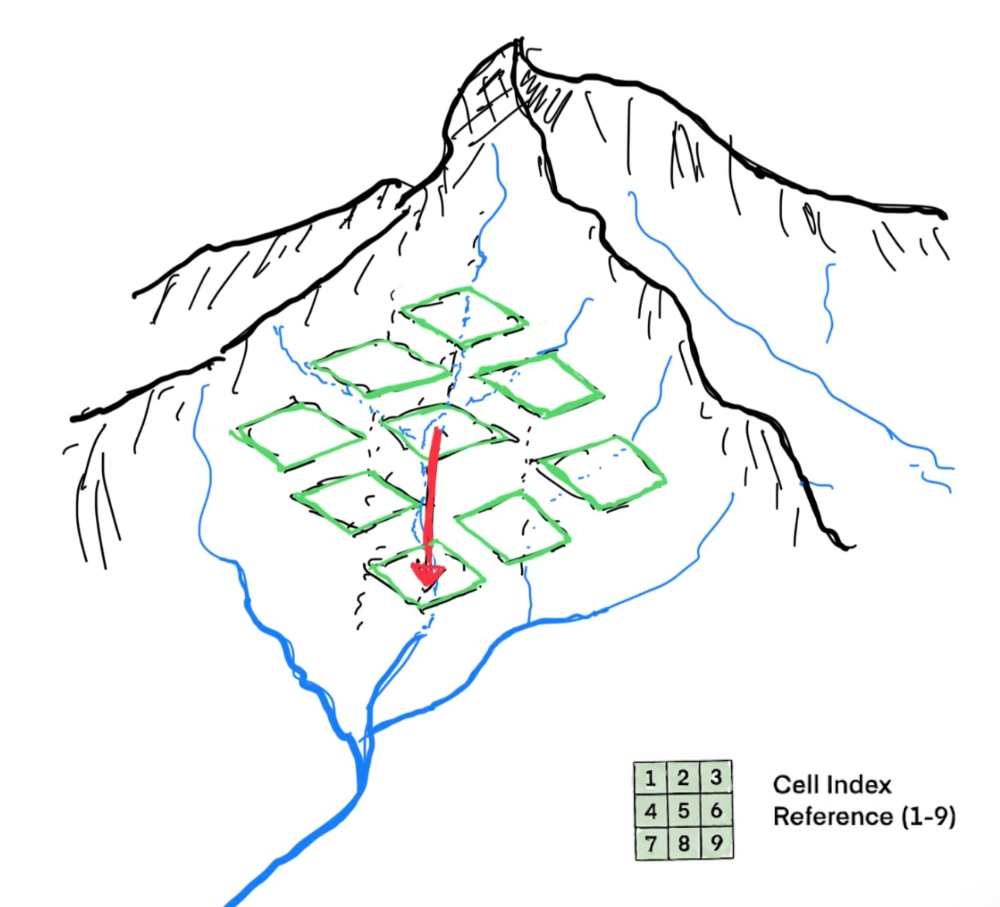

# WhereTheWaterFlows.jl

[](https://github.com/mauro3/WhereTheWaterFlows.jl/actions)
[](https://codecov.io/gh/mauro3/WhereTheWaterFlows.jl)
[](https://doi.org/10.5281/zenodo.7086860)

WhereTheWaterFlows routes water on gridded topography (or hydraulic potential)
with a D8 algorithm combined with a breach algorithm for depression filling.
It supports deterministic flow routing, DEM filling, catchment analysis,
coupled feedbacks, subglacial routing physics, and uncertainty propagation.

The package currently has three modules:

- `WhereTheWaterFlows`: core deterministic routing and post-processing (WWF)
- `WhereTheWaterFlows.Subglacially`: subglacial hydraulic-potential routing (WWFS)
- `WhereTheWaterFlows.Randomly`: Monte Carlo wrappers for uncertainty studies (WWFR)

The two submodules can be used independently of each other or combined.

## When to use WWF

Hydrological flow routing on DEMs is a fundamental operation in geosciences:
it underpins catchment delineation, runoff modelling, subglacial hydrology,
and landscape-evolution studies.

WWF is suitable for any domain where DEM-based flow analysis is required.
However, the package has been designed with glaciological applications in mind (see [References](@ref refs)), and thus also has non-traditional features:

- Shreve potential routing at the glacier bed
- uncertainty quantification as glacier bed DEMs and Shreve-potential are not well known


## Installation

Using Julia v1.12 or later:

```julia
using Pkg
Pkg.add("WhereTheWaterFlows")
```

Plotting functions are provided through a Makie extension.  Load any Makie
backend alongside the package to enable them:

```julia
using WhereTheWaterFlows, GLMakie   # or CairoMakie, WGLMakie, …
```

Submodules are bundled in the same package and are typically used like so:

```julia
using WhereTheWaterFlows
const WWF  = WhereTheWaterFlows
const WWFS = WhereTheWaterFlows.Subglacially
const WWFR = WhereTheWaterFlows.Randomly
```

## Quick start

```julia
using WhereTheWaterFlows

# build a small synthetic DEM
x = y = range(-π, π, length=200)
dem = sin.(x) .* cos.(y')

out = waterflows(dem)
maximum(out.area), length(out.sinks)
```

See the [Tutorial](@ref) for a full walk-through of the core API.

## Where to ask questions and how to contribute

Questions and general discussions can be posted on [https://github.com/mauro3/WhereTheWaterFlows.jl/discussions](https://github.com/mauro3/WhereTheWaterFlows.jl/discussions).

You are welcome to contribute to WWF by filing issues and making pull-requests; please first have a look at [https://github.com/mauro3/WhereTheWaterFlows.jl/blob/master/CONTRIBUTING.md](https://github.com/mauro3/WhereTheWaterFlows.jl/blob/master/CONTRIBUTING.md).

## Algorithm



The core routing uses the D8 algorithm: each cell drains to whichever of its
eight neighbours has the steepest downward gradient. The illustration above shows cells of a DEM overlain on a "real" topography
and the direction of routing.

Local minima (pits) are
handled by default via a breach-type algorithm that finds the lowest spillway
for each pit and reverses flow along that path, so the input DEM does not need
to be pre-filled (or pre-processed in any other way). Both algorithms are described by O’Callaghan & Mark (1984).
The flow is accumulated by recursively traversing the drainage tree, the algorithm has O(n) complexity where n is the number of cells (Braun & Willett, 2013).
On large DEMs the recursion depth can exceed the default Julia call-stack size and cause
a `StackOverflowError`.


